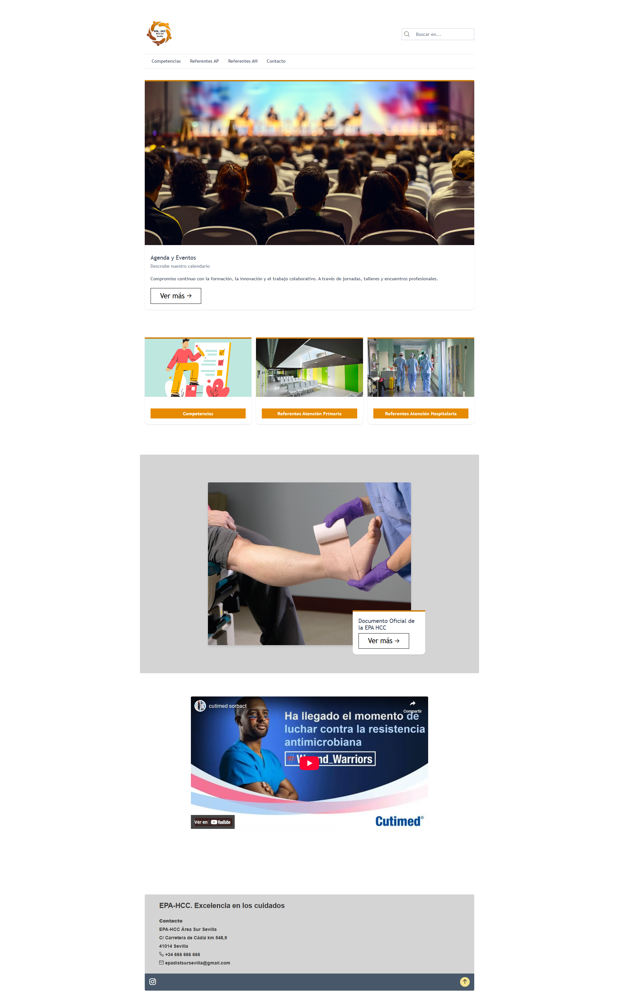
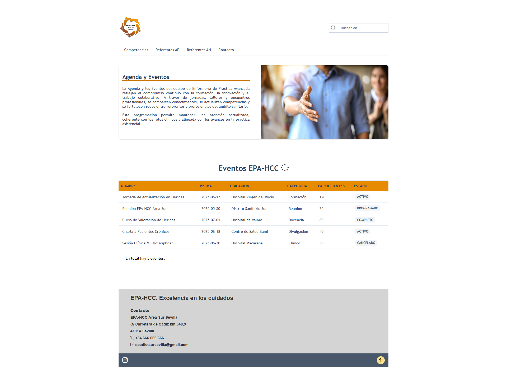
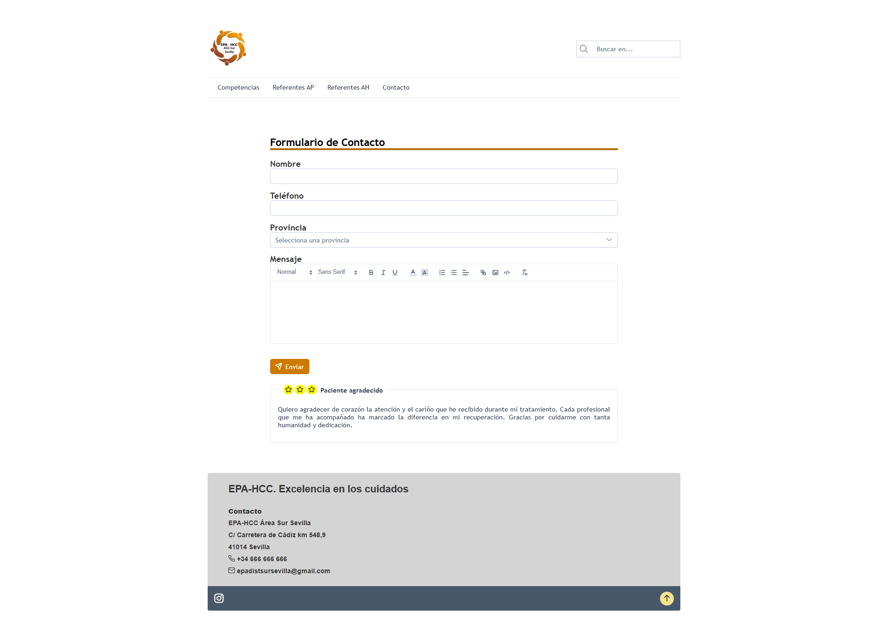

# EpaWeb – Raising Awareness of the Advanced Practice Nurse in Chronic and Complex Wounds (EPA-HCC)

## 📌 Description

**EpaWeb** is a frontend web application created to increase visibility and recognition of the **EPA-HCC** role (Advanced Practice Nurse in Chronic and Complex Wounds).  
This professional profile plays a crucial part in the Spanish healthcare system but remains largely unknown to the public.

The platform combines **technical information**, **real-life interviews**, and **official healthcare resources** to inform users in an accessible and modern way.

> 🎓 This project was developed as part of my final degree project for the Vocational Training Program in Multiplatform Application Development.

---

## 🛠️ Tech Stack

- **Angular 18**
- **PrimeNG (Aura theme)**
- **PrimeIcons**
- **TypeScript**
- **SCSS / CSS Flexbox & Grid**
- **Excalidraw** (UI sketches)

---

## 🎨 Features

- Modular and maintainable component-based structure
- Fully responsive layout
- Accessible UI design, focused on elderly users
- Custom styling of PrimeNG components
- Integration of real interview content
- Backend was planned but not implemented; all data is currently static

---

## 📷 Screenshots

  
  
  
  

This project was generated with [Angular CLI](https://github.com/angular/angular-cli) version 18.2.5.

## Development server

Run `ng serve` for a dev server. Navigate to `http://localhost:4200/`. The application will automatically reload if you change any of the source files.

